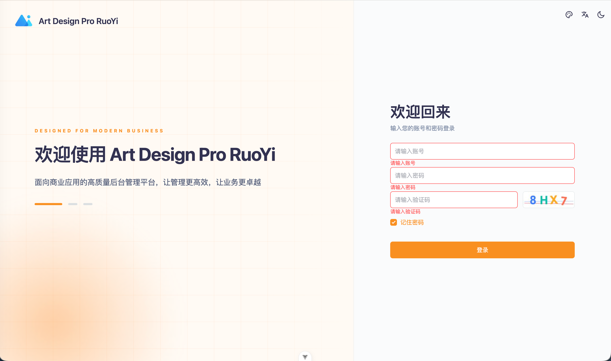
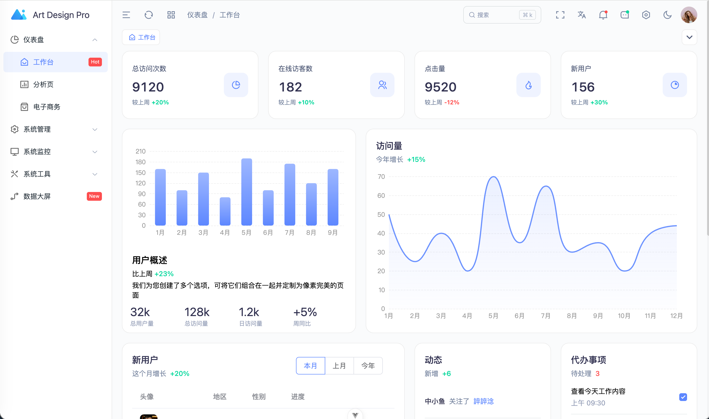
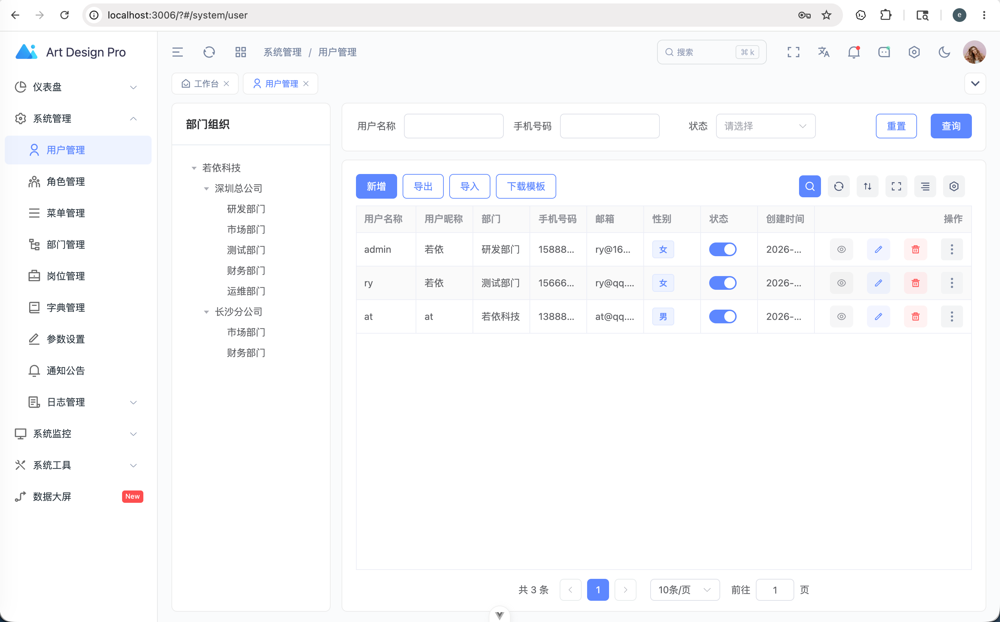
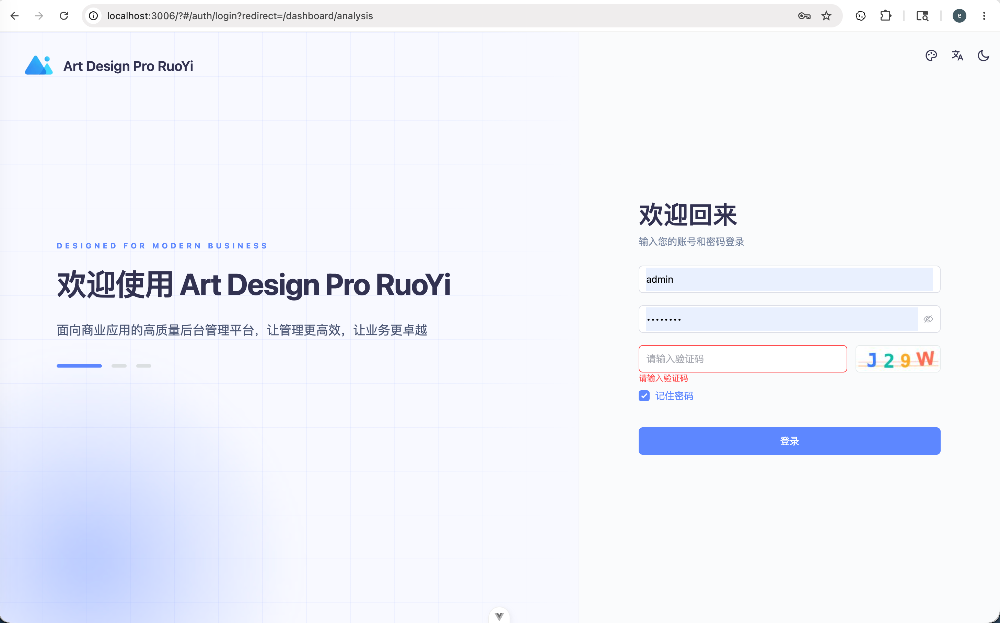
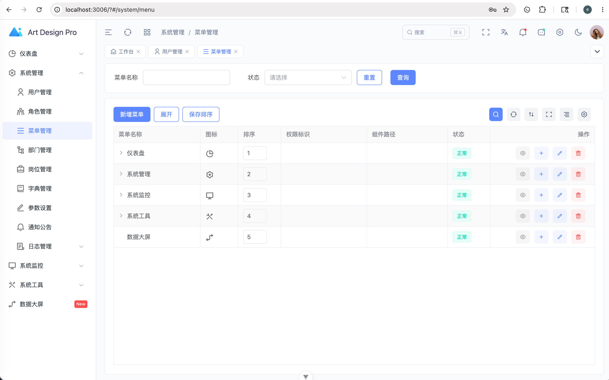
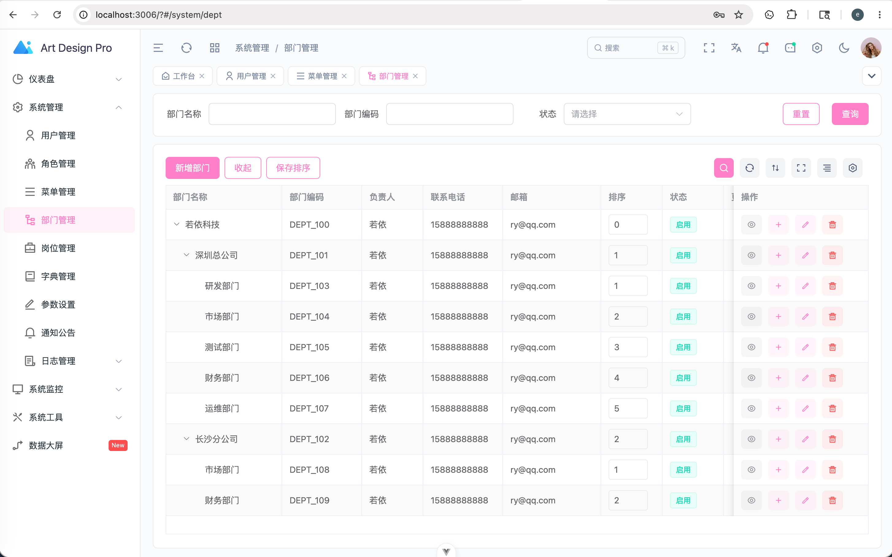
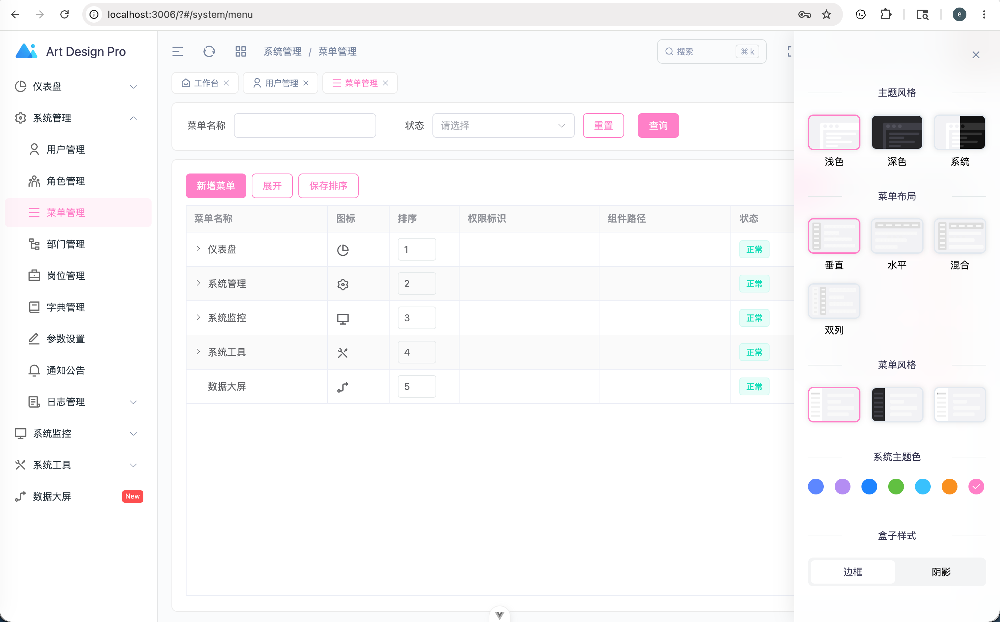
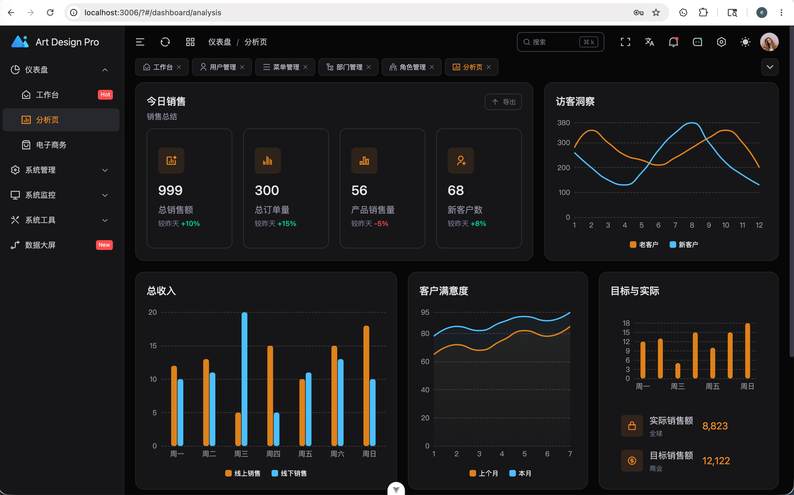

# Art Design Pro RuoYi

基于 **RuoYi-Vue 后端** 与 **Art Design Pro 前端** 整合的现代化后台管理系统。

本项目保留 RuoYi 成熟的权限体系、系统管理、系统监控与代码生成能力，使用 Art Design Pro / artpro-ui 替换传统前端界面。目标不是重写 RuoYi，而是在兼容原有接口和 RBAC 模型的基础上，提供更现代的 Vue 3 管理后台体验。

> RuoYi 负责稳定的业务底座，Art Design Pro 负责现代化的交互与视觉体验。

仓库地址：[Searchld/art-design-pro-ruoyi](https://github.com/Searchld/art-design-pro-ruoyi)

## 项目预览

演示地址：[https://art.beta.kim/](https://art.beta.kim/)

```text
用户名：admin
密码：admin123
```

### 登录页



### 仪表盘



### RuoYi 系统管理

<table>
  <tr>
    <td></td>
    <td></td>
  </tr>
  <tr>
    <td align="center">用户管理</td>
    <td align="center">角色权限</td>
  </tr>
  <tr>
    <td></td>
    <td></td>
  </tr>
  <tr>
    <td align="center">菜单管理</td>
    <td align="center">部门管理</td>
  </tr>
</table>

### 主题配置

<table>
  <tr>
    <td></td>
    <td></td>
  </tr>
  <tr>
    <td align="center">主题色、菜单布局与样式切换</td>
    <td align="center">深色主题与数据分析页</td>
  </tr>
</table>

## 项目特点

- 保留 RuoYi RBAC、JWT、菜单权限、按钮权限和数据权限。
- 复用 RuoYi `/system/*`、`/monitor/*`、`/tool/*`、`/common/*` 接口。
- 前端使用 Art Design Pro / artpro-ui，不采用传统 RuoYi-Vue 页面风格。
- 使用后端动态菜单模式，路由由 `GET /getRouters` 返回并转换为 Art 路由结构。
- 支持 `v-auth` 与 `hasAuth()` 按钮权限控制。
- 支持图片验证码与 Art 滑块验证码切换。
- 支持站点名称、登录文案、登录安全和公共水印等全局后台配置。
- 主题模式、主题色、菜单布局等界面风格按用户 ID 持久化到数据库。
- 支持浅色、深色和自动主题模式。
- 内置可配置的 Art Bot AI 助手，支持 OpenAI Chat Completions 兼容接口、多模型选择、SSE 流式输出和历史会话。
- 操作日志复用 RuoYi 审计机制，并将缓存详情、缓存清理等敏感操作拆分为独立权限。
- 代码生成器新增 Art Design Pro TypeScript 模板，生成结果直接复用 Art 表格、搜索、表单、抽屉和权限封装。

## 技术栈

### 后端：RuoYi

| 技术 | 说明 |
| --- | --- |
| Spring Boot 4 | 后端基础框架 |
| Spring Security | 登录认证与权限校验 |
| JWT | 访问令牌 |
| MyBatis + PageHelper | 数据访问与分页 |
| MySQL | 业务数据 |
| Redis | 登录状态与验证码缓存 |
| Quartz | 定时任务 |
| Springdoc OpenAPI | API 文档 |

### 前端：Art Design Pro

| 技术 | 说明 |
| --- | --- |
| Vue 3 + TypeScript | 前端开发框架 |
| Vite | 开发与构建工具 |
| Art Design Pro / artpro-ui | 页面、布局和业务组件 |
| Element Plus | 基础 UI 组件 |
| Pinia | 状态管理 |
| Vue Router | 动态路由 |
| ECharts | 数据可视化 |

## 适配关系

| RuoYi 能力 | Art 前端适配 |
| --- | --- |
| `POST /login` | 登录并保存 RuoYi token |
| `GET /getInfo` | 映射用户信息、角色和按钮权限 |
| `GET /getRouters` | 转换为 Art 后端动态路由 |
| `POST /logout` | 清理 token、用户信息、菜单和页签 |
| `GET /captchaImage` | 图片验证码或滑块验证码配置 |
| RuoYi `F` 类型菜单 | 合并为页面 `meta.authList` |
| RuoYi 权限标识 | 使用 `v-auth` 与 `hasAuth()` 控制按钮 |
| RuoYi 字典接口 | 用于下拉选项与状态标签 |
| RuoYi 导入导出 | 复用原有上传、模板与导出接口 |
| RuoYi RBAC 按钮权限 | 控制 Art Bot 入口、模型管理、缓存详情和缓存清理 |
| `sys_user_ui_setting` | 按用户 ID 保存主题、菜单布局等界面偏好 |

前端固定使用后端权限模式：

```env
VITE_ACCESS_MODE = backend
```

## 已接入功能

### 系统管理

- 用户管理：部门筛选、CRUD、状态切换、重置密码、角色分配、导入导出。
- 角色管理：CRUD、菜单权限、数据权限、授权用户和导出。
- 菜单管理：目录、菜单、按钮、内嵌页面、外链和排序。
- 部门管理：树形结构、部门编码、子部门和排序。
- 岗位管理、字典管理、参数设置、通知公告。
- AI 模型管理：模型增删改查、默认模型、启停状态和连接测试。

### 系统监控

- 在线用户、操作日志、登录日志。
- 定时任务与任务日志。
- 服务监控、缓存监控和缓存列表。
- Druid 数据监控。
- 缓存内容读取与缓存清理使用独立按钮权限，并记录敏感操作审计日志。

### 系统工具

- 代码生成：保留 RuoYi 后端代码生成能力，并新增 Art Design Pro TypeScript 前端模板。
- 表单构建。
- Swagger UI 系统接口文档。

### 公共能力

- 个人中心、修改密码和头像上传。
- 图片验证码与滑块验证码切换。
- 文件上传、导入、导出。
- 动态菜单、按钮权限和字典缓存。
- Art Dashboard 工作台、分析页和电子商务页。
- 数据大屏菜单与展示页。
- 顶部通知、公告、待办和按用户记录的已读状态。
- 全局站点配置、用户级主题切换和公共水印。
- Art Bot AI 助手：按用户保存会话，支持流式回复、停止生成和 Markdown 安全渲染。

## Art Bot

右上角 Art Bot 入口由 `artbot:chat:use` 权限控制。管理员可以在“系统管理 > AI 模型管理”中维护多个 OpenAI Chat Completions 兼容模型。

模型配置包括：

- 模型名称、API Base URL、API Key 和模型标识。
- 启用状态、默认模型、`temperature`、`maxTokens` 和系统提示词。
- 连接测试、默认模型唯一性和已有会话引用保护。

后端会自动将 Base URL 拼接为 `/chat/completions`。API Key 不会通过管理接口回传明文，但当前版本仍以明文写入数据库，生产环境应限制数据库访问权限。

## 权限补充

| 权限标识 | 用途 |
| --- | --- |
| `artbot:chat:use` | 显示并使用右上角 Art Bot |
| `system:artbot:*` | 管理 AI 模型与连接测试 |
| `monitor:cache:list` | 查看缓存概览、分类和键名 |
| `monitor:cache:query` | 查看具体缓存值 |
| `monitor:cache:remove` | 清理单个键、缓存分类或全部缓存 |

新增缓存敏感权限不会自动授予普通角色。RuoYi 超级管理员仍通过原有逻辑拥有全部权限，其他角色应由管理员按需分配。

## Art 代码生成

本项目对 RuoYi 代码生成器进行了专门适配。导入业务表时默认选择 `Art Design Pro TypeScript`，生成的前端代码可以直接放入 `artpro-ui`，不再生成传统 RuoYi-Vue 页面。

Art 模板会生成：

- 基于 `ArtSearchBar`、`ArtTableHeader`、`ArtTable` 和 `useTable` 的列表页面。
- 基于 `ArtForm` 与抽屉表单的新增、修改交互。
- 使用 `v-auth` 的新增、修改、删除、导出按钮权限。
- 使用 `useDict` 和 `DictTag` 的字典下拉框与状态标签。
- 对接 `/common/upload` 的图片、文件上传字段，以及复用 `ArtWangEditor` 的富文本字段。
- 与 Art 前端 Axios 封装兼容的 TypeScript API 文件。

当前 Art 模板覆盖单表 CRUD、树表、主子表和可选详情页。原有 `Element Plus TypeScript` 与 `Element Plus` 模板继续保留，可在导入表或修改生成配置时切换。

增量脚本 `sql/20260601_default_art_design_pro_generator.sql` 只会把新导入表的默认模板改为 `art-design-pro`，不会批量修改已有 `gen_table` 记录，避免影响历史生成配置。

## 项目结构

```text
ruoyi-art-design-pro
├── artpro-ui          # Art Design Pro Vue 3 前端
├── ruoyi-admin        # RuoYi Web 服务入口
├── ruoyi-framework    # 安全认证、JWT、验证码等核心能力
├── ruoyi-system       # 系统管理业务
├── ruoyi-quartz       # 定时任务
├── ruoyi-generator    # 代码生成
├── ruoyi-common       # 通用工具
├── sql                # 初始化与增量 SQL
└── docs               # 整合实施说明
```

## 本地启动

### 环境要求

- JDK 17+
- Maven 3.8+
- Node.js 20.19+
- pnpm 8.8+
- MySQL 8+
- Redis

### 1. 初始化数据库

创建数据库：

```sql
CREATE DATABASE `ry-vue` DEFAULT CHARACTER SET utf8mb4 COLLATE utf8mb4_unicode_ci;
```

导入初始化脚本：

```bash
mysql -uroot -p ry-vue < sql/ry_20260417.sql
```

已有 RuoYi 数据库按需执行增量脚本：

```bash
mysql -uroot -p ry-vue < sql/20260531_add_sys_dept_code.sql
mysql -uroot -p ry-vue < sql/20260531_add_site_config.sql
mysql -uroot -p ry-vue < sql/20260531_add_dashboard_menu.sql
mysql -uroot -p ry-vue < sql/20260601_extend_menu_meta.sql
mysql -uroot -p ry-vue < sql/20260601_add_data_screen_menu.sql
mysql -uroot -p ry-vue < sql/20260601_add_notice_todo_type.sql
mysql -uroot -p ry-vue < sql/20260601_default_art_design_pro_generator.sql
mysql -uroot -p ry-vue < sql/20260602_add_artbot.sql
mysql -uroot -p ry-vue < sql/20260602_add_user_ui_setting.sql
mysql -uroot -p ry-vue < sql/20260602_tighten_cache_permissions.sql
```

### 2. 修改后端配置

数据库配置位于：

```text
ruoyi-admin/src/main/resources/application-druid.yml
```

Redis 和服务端口配置位于：

```text
ruoyi-admin/src/main/resources/application.yml
```

默认后端端口：

```text
http://localhost:8080
```

### 3. 启动后端

```bash
mvn clean package -DskipTests
java -jar ruoyi-admin/target/ruoyi-admin.jar
```

开发时也可以直接从 IDE 启动：

```text
com.ruoyi.RuoYiApplication
```

### 4. 启动前端

```bash
cd artpro-ui
pnpm install
pnpm dev
```

前端开发接口地址位于：

```text
artpro-ui/.env.development
```

默认配置：

```env
VITE_API_URL = http://localhost:8080
VITE_API_PROXY_URL = http://localhost:8080
VITE_ACCESS_MODE = backend
VITE_PORT = 3006
```

默认前端地址：

```text
http://localhost:3006
```

## 默认账号

```text
账号：admin
密码：admin123
```

默认配置仅适用于本地开发，部署前请修改数据库密码、Redis 配置和 JWT secret。

## SQL 说明

| 文件 | 用途 |
| --- | --- |
| `sql/ry_20260417.sql` | 完整数据库初始化 |
| `sql/20260531_add_sys_dept_code.sql` | 增加部门编码 |
| `sql/20260531_add_site_config.sql` | 增加站点、主题与安全配置 |
| `sql/20260531_add_dashboard_menu.sql` | 增加 Art Dashboard 菜单 |
| `sql/20260601_extend_menu_meta.sql` | 扩展菜单元数据 |
| `sql/20260601_add_data_screen_menu.sql` | 增加数据大屏菜单 |
| `sql/20260601_add_notice_todo_type.sql` | 增加待办通知类型 |
| `sql/20260601_default_art_design_pro_generator.sql` | 设置代码生成默认模板 |
| `sql/20260602_add_artbot.sql` | 增加 Art Bot 模型、会话、消息表和权限 |
| `sql/20260602_add_user_ui_setting.sql` | 将界面风格改为按用户 ID 入库 |
| `sql/20260602_tighten_cache_permissions.sql` | 拆分缓存详情与缓存清理权限 |

## 加入微信交流群

欢迎加入 `art pro ruoyi` 微信交流群，交流项目使用、功能适配和问题反馈。

<table>
  <tr>
    <td></td>
    <td></td>
  </tr>
  <tr>
    <td align="center">扫码加入微信群</td>
    <td align="center">二维码失效时添加 ABCDE 邀请入群</td>
  </tr>
</table>

> 群二维码有效期至 2026 年 6 月 9 日。过期后请添加联系人微信邀请入群，或关注仓库更新后的二维码。

## 开发约定

- 页面优先复用 Art 现有组件、Hooks 和布局能力。
- CRUD 页面优先使用 Art 表格、搜索、表单和抽屉封装。
- 后端尽量复用 RuoYi 原有接口和数据结构。
- 不重复实现 RuoYi RBAC、JWT、数据权限和菜单权限。
- Element Plus 仅用于 Art 未覆盖的基础组件。

详细适配说明见：[docs/ruoyi-art-plan.md](docs/ruoyi-art-plan.md)。

## 致谢

- [RuoYi-Vue](https://gitee.com/y_project/RuoYi-Vue)
- [Art Design Pro](https://github.com/Daymychen/art-design-pro)

## License

本仓库包含基于 RuoYi 与 Art Design Pro 的整合代码。使用前请分别遵守上游项目许可证以及本仓库中的许可证文件。
